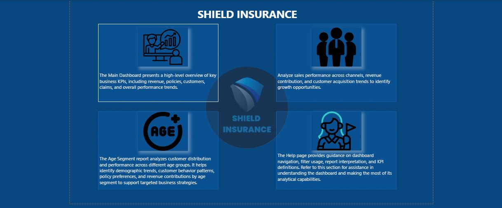
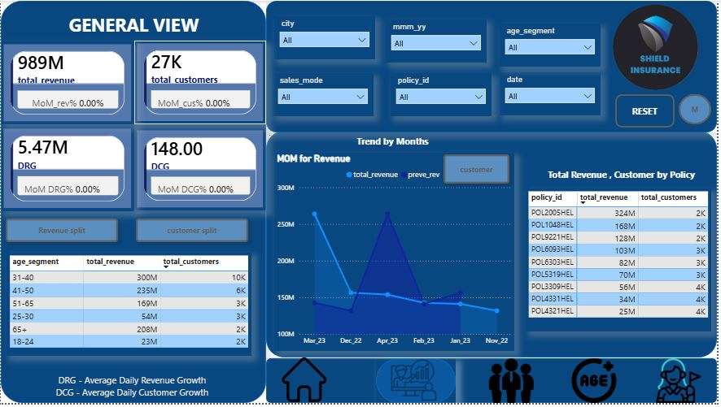
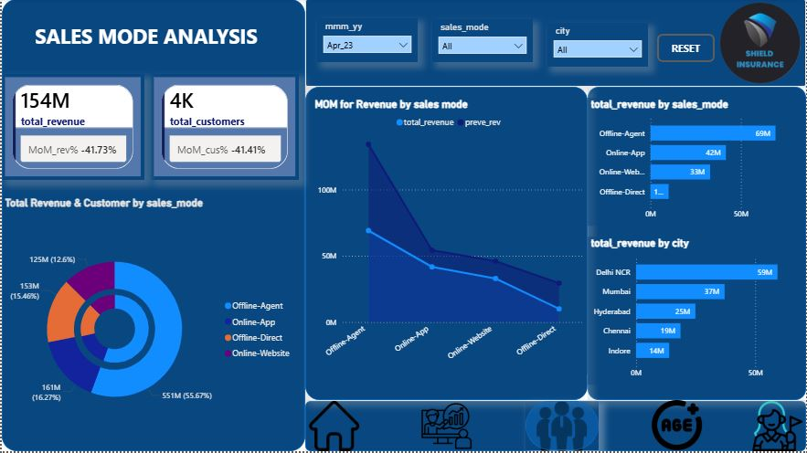
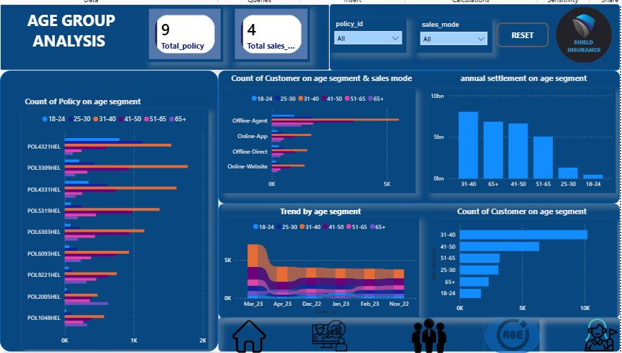

# 🏥 Insurance Analytics Dashboard | Power BI

## 📌 Overview

This Power BI project analyzes insurance business performance by tracking revenue, customers, policies, sales channels, and customer demographics. It helps in understanding business growth and making data-driven decisions using interactive dashboards.

---

## 🎯 Business Requirements

- Track total customers and total revenue
- Monitor revenue and customer growth over time
- Analyze sales channel performance
- Understand customer distribution by age group
- Evaluate policy performance
- Identify key business trends and insights

---

## 📄 Dashboard Design Process (Mockup)

Before building the final dashboard, a mock dashboard was created to plan layout, KPIs, and user experience.

📌 The mockup helped in defining:
- KPI placement
- Visual structure
- Navigation flow
- Dashboard storytelling

📄 **Mock Dashboard (PDF):**  
👉 [View Mock Dashboard](./Shield_Insurance_mock_up.pdf)

---

## 📊 Final Dashboard

The final Power BI dashboard was developed based on the mock design and enhanced with DAX measures and interactive visuals.

### 🖼 Dashboard Screenshots

#### Home Page

#### Main Dashboard

#### Sales Mode Analysis

#### Age Group Analysis

---

## 🚀 Live Dashboard

👉 **Explore Interactive Report**

🔗 [View Power BI Dashboard](https://app.powerbi.com/view?r=eyJrIjoiYmFmMzM2MmQtZWE2Ni00ZGMwLWE4MmEtOWY4YzAxODVkNTQ4IiwidCI6ImM2ZTU0OWIzLTVmNDUtNDAzMi1hYWU5LWQ0MjQ0ZGM1YjJjNCJ9)

---

## 📊 Key KPIs

- Total Revenue
- Total Customers
- Total Policies
- Revenue Growth %
- Customer Growth %

---

## 🗂 Data Model

The project follows a **Star Schema** design.

### Fact Table
- fact_premiumn
- fact_settlements

### Dimension Tables
- dim_Customer
- dim_Date
- dim_Policy

---

## 🧮 DAX Concepts Used

- CALCULATE()
- FILTER()
- ALL()
- DIVIDE()

---

## 📌 Key Insights

- Revenue and customer growth trends over time
- Best performing sales channels
- Customer distribution by age group
- Policy performance analysis
- Business performance tracking through KPIs

---

## 🛠 Tools Used

- Power BI Desktop
- Power Query
- DAX (Data Analysis Expressions)
- Data Modeling
- Data Visualization

---

## 👩‍💻 Author

**Safina Begum**  
Power BI Developer | Data Analyst Enthusiast

🔗 GitHub: [Dudekula-Safina-Begum](https://github.com/Dudekula-Safina-Begum)

🔗 LinedIn: [Dudekula-Safina-Begum](https://www.linkedin.com/in/dudekula-safinabegum/)
---

⭐ If you like this project, don't forget to star the repository!
